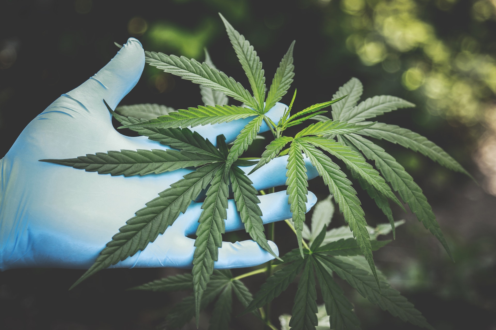

export default ({ children }) => 
{children}

What is CBD? What is THC? What is Delta 8? Where do they come from and how do they compare to each other?

All of these chemicals are related to each other under the same family tree. Each one is extracted from the cannabis plant and are appropriately called ‘cannabinoids'. There are over 100 different cannabinoids in the cannabis plant. The two main cannabinoids are CBD (Cannabidiol) and THC (Delta 9 Tetrahydrocannabinol). The biggest difference between the two is that CBD is considered non-psychoactive, while THC is psychoactive.

**How can these two differ so much when they come from the same source?**

It’s a common misconception that hemp and marijuana are two different species of plant. Both hemp and marijuana are taxonomically the same plant. This means that they are different names for the same genus - Cannabis. But while marijuana comes from both the cannabis indica and cannabis sativa plant, hemp belongs solely to the cannabis sativa family.

While science doesn’t differentiate between “hemp” and “marijuana,” the law does. Legally, the key difference between the two is THC content. The term “hemp” is used to mean cannabis that contains 0.3 percent or less THC content by dry weight and is typically labeled as CBD. While hemp still has some THC, it’s impossible to smoke enough hemp to get high.

**What is delta 8 and how does it come into play?**

Delta 8 is a complicated cannabinoid that has recently been receiving a lot of attention. Delta 8 is largely made by converting CBD or delta 9 THC into delta 8 THC synthetically. Some people fear that this synthetic conversion process has adverse health effects when using the product. There is simply not enough data to confirm nor deny this fear. All that is known is these products affect individuals differently.

Delta 8 is complicated because it can contain less than 0.3% delta 9 THC yet still offer psychoactive effects. The effects are stronger than regular CBD, but not as strong as delta 9 THC. A psychoactive hemp product? That doesn’t line up with the earlier information, hence the complication.

**Is Delta 8 Legal?**

Restrictions vary by state but are ultimately controlled on the federal level. Delta 8 is considered legal through a loophole in the 2018 Farm Bill. This bill states that any cannabinoid derived from hemp—defined as cannabis containing less than 0.3% delta 9 THC—was a legal product. This bill specifically restricts delta 9 THC, making all other cannabinoids free game. This bill probably only restricted delta 9 because delta 8 and its cousins were not around at the time. Nevertheless, delta 8 is controversial and its legal status may change at any time.
